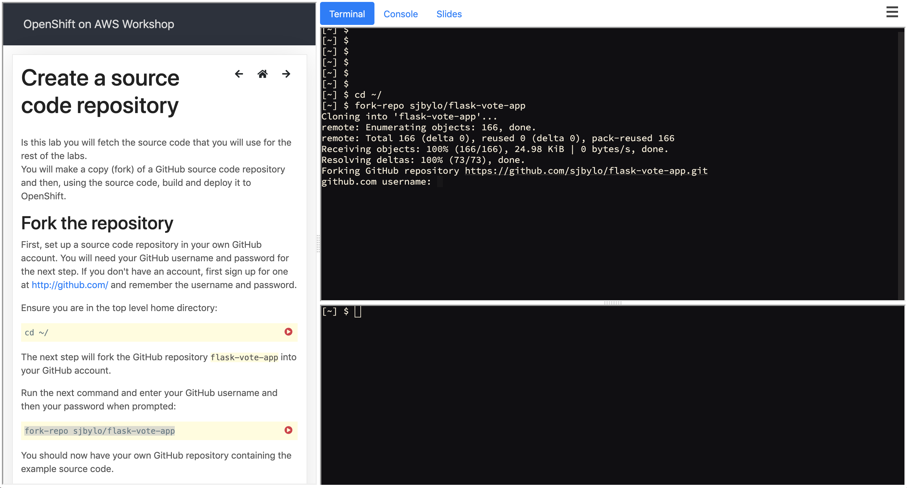

# This is a workshop for OpenShift 4

This workshop runs in a container and is based on the work done [here](https://github.com/openshift-labs/workshop-dashboard/).

The workshop looks like this.



## How to launch the workshop. See the template "production.json" for all the paramaters that can be set.

```
oc new-app https://raw.githubusercontent.com/openshift-labs/workshop-dashboard/master/templates/production.json \
  --param TERMINAL_IMAGE="quay.io/openshiftlabs/lab-workshop-content:1.3" \
  --param APPLICATION_NAME=lab-ocp4 \
  --param AUTH_USERNAME=workshop \
  --param AUTH_PASSWORD=workshop 
```


## How to make changes

Create a build config object.  Make changes to the content under workshop/.  Re-build by starting the build.

```
oc new-build --name lab-ocp4 --binary --strategy docker
oc start-build lab-ocp4 --from-dir . --follow
```
