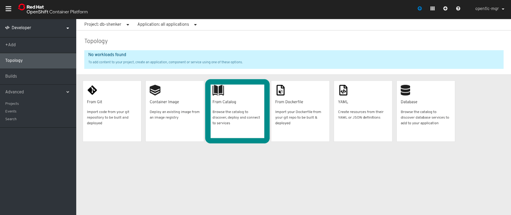
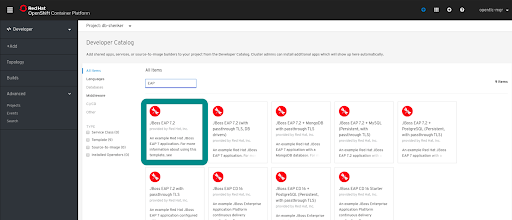
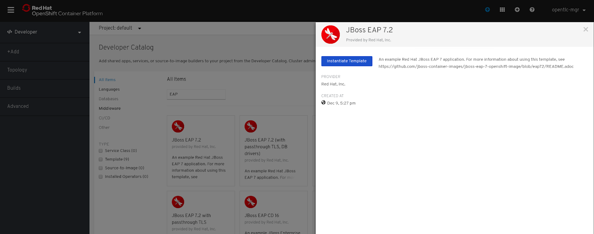
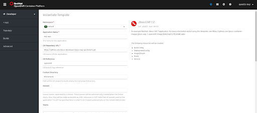
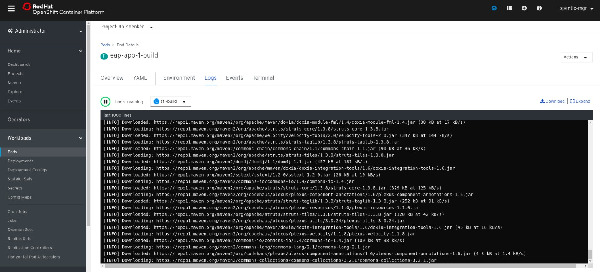
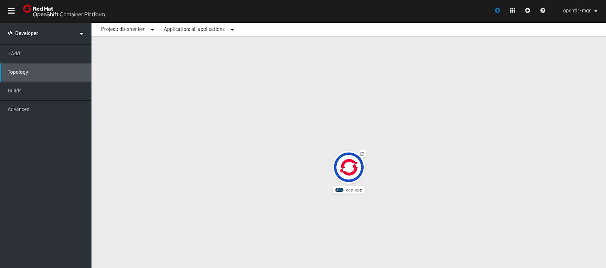
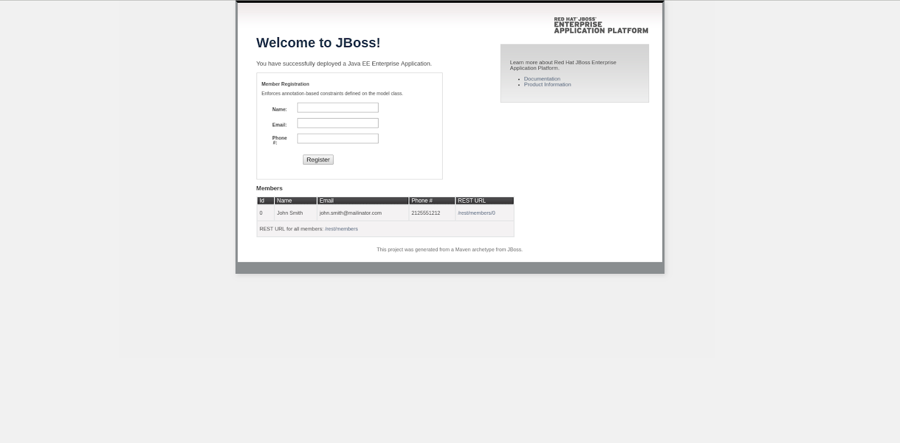

In this exercise you will launch a J2EE application directly from source code using a the ``template`` and ``Source To Image`` features of OpenShift. 

We are going to create an application from the developer catalog to demonstrate the self service capability from templates pre-provisioned for convenience of usage in the OpenShift environment.

The application of interest will run on the JBoss enterprise application platform, notably JBoss EAP 7.2, as highlighted in the green box. 

Go ahead and instantiate the template, which provides the user with a wealth of customization choices for the creation of the JBoss application. 

Notable configurations we should take note of in making use of the template are:

Namespace: ``make sure it is your project namespace not the default project``

Application Name: as per the instructions, or named accordingly depending on the appropriate context.

Git Repository URL: OpenShift has default value ready references for convenience

<!--
> and users are welcomed to use a Git Repo of their choice which works in the creation of the application. 
-->

For demonstration purposes we are only going to use the default settings, though it is encouraged for users to experiment and practice with the environment in their own time and convenience. 

Note this is from the administrator view, the logging allows us to see the process of the creation of the APP for those tracking the progress of application creation. 

The blue circle indicates the successful creation of the JBoss EAP Application, which can be accessed via the hostname by clicking on the icon. 

This is the expected output once users successfully create the application and access it. 

---

Congratulations!! You are now running a JBoss EAP application on OpenShift.

