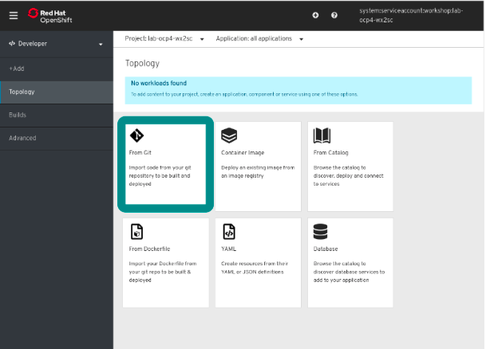
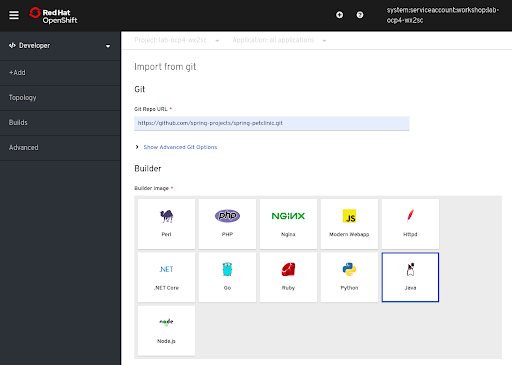
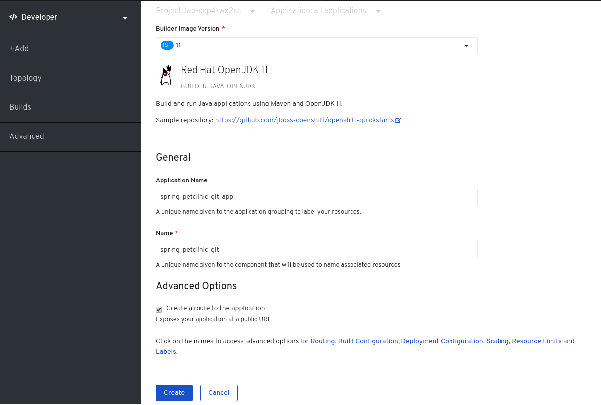
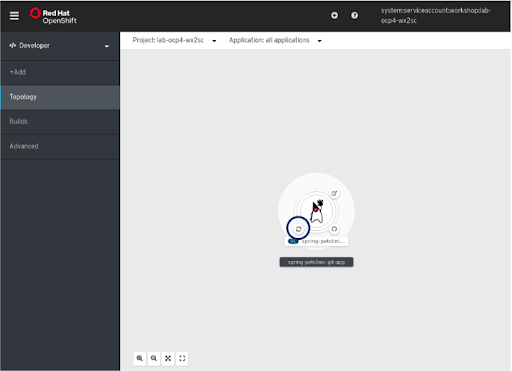
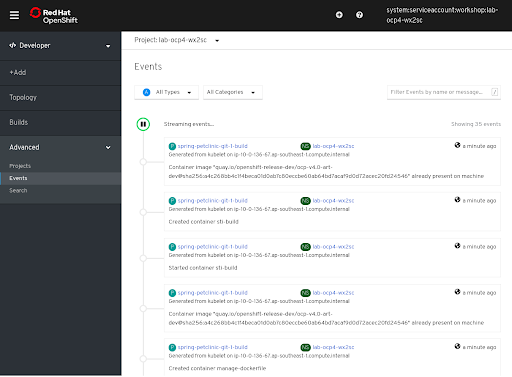
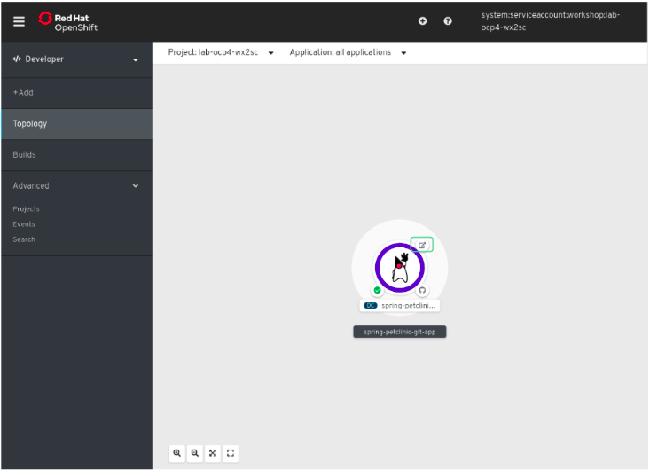
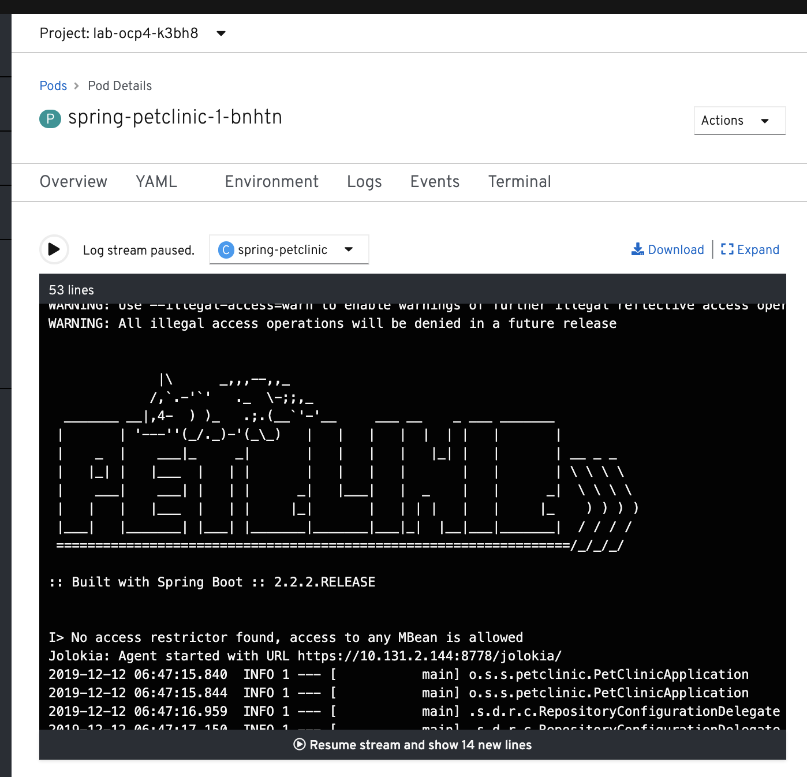
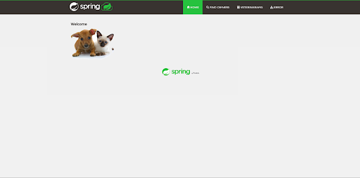
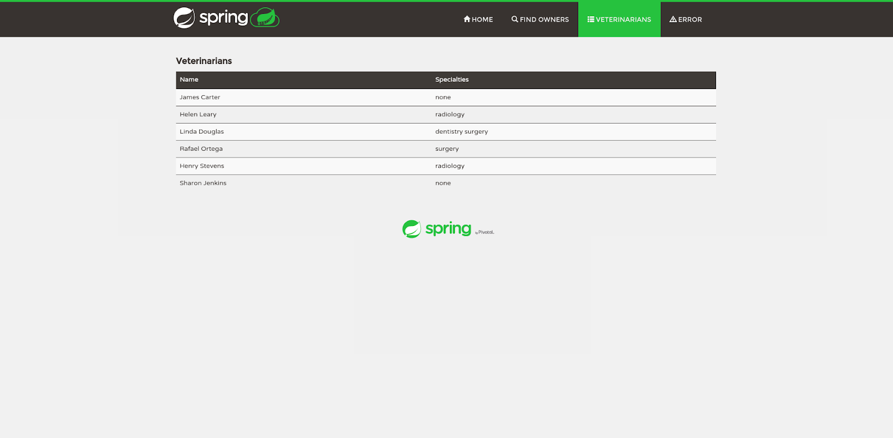

In this exercise you will create a SpringBoot application from source code (using Source to Image) and run it on OpenShift. 

If not already, let's  delete the contents of your project:

```execute
oc delete all --all
```

First, Click on the ``Console`` tab at the top of the screen. 

If not already, switch to the ``Developer`` perspective (click on the ``Administrator`` menu item and select ``Developer``). 

As we can see from the ``Topology`` view, there ar no running applications at the moment and we are presented with the following options to create applications. 

Click on ``+Add`` in the left-menu. 

  - ``Note``: if you see the error ``Restricted Access``, ensure you select the correct project at the top of the page. 

In this lab, we will build and launch the SpringBoot ``Pet Clinic`` application by referencing the source code in GitHub.  

You can read more about the ``Developer Catalog`` in the [documentation](https://docs.openshift.com/container-platform/4.2/applications/application-life-cycle-management/odc-creating-applications-using-developer-perspective.html#odc-creating-applications-using-developer-perspective) 

Select the ``From Git`` option to kick off the application creation process. 



We will pull the source code directly from GitHub.  Copy and enter the following git URL: 

```copy
https://github.com/spring-projects/spring-petclinic
```


Click on the ``Java`` icon: 



This will bring you to the Configuration section. All the fields in this section denote the parameters that can be set.  Take a look at all the different parameters and set the following: 

``Builder image version``: Selected Java version 11.

``Application Name``: spring-petclinic-git-app. This gives a name to the application which will be displayed in the Topology view.  Multiple components of an application can be grouped (and displayed together) in this way.  

Take note of and have a look around at the ``Advanced Options``. Here you will find options for security, building, scaling etc. 

Click on the ``Create`` button which will trigger the Source to Image process.  You will see the ``Topology`` view with the Java icon inside a "donut". 




The application starts to build.  The lack of presence of any coloured ring around the application donut indicates that the building process is ongoing.

By clicking the icon circled by the blue circle, we can inspect the ongoing process of the source code build.





Similar to the above, through the ``Events`` sub tab we can inspect the respective ongoing events in the process of the application creation.



Wait a few minutes for the application to finish building.

A blue ring around the created Application denotes a successfully created application ready for usage.

Conversely, a red ring around the created Application denotes a failed creation of the application.




Click in the middle of the donut and then, to the right of the pod,  click on "view logs".  You will see the SprintBoot application starting up:




Once the application has started up successfully, click on the decoration on the top-right of the donut to open the application (in the green box). 


The running application looks like this:  






Congratulations!! You are now running a Java SpringBoot application on OpenShift.

# Clean up

Remove the application:

```execute
oc delete all --all
```

