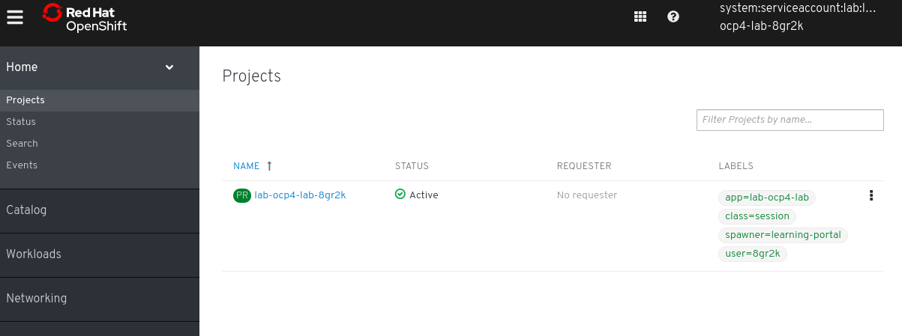
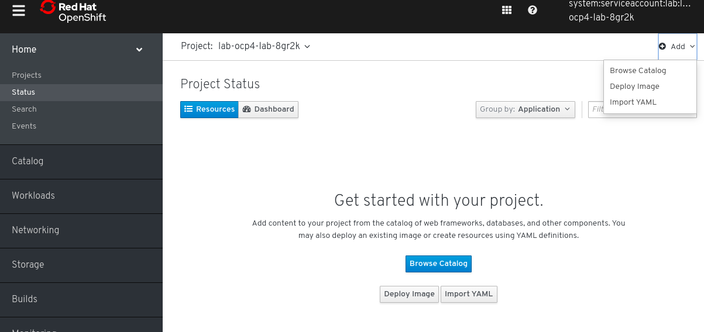
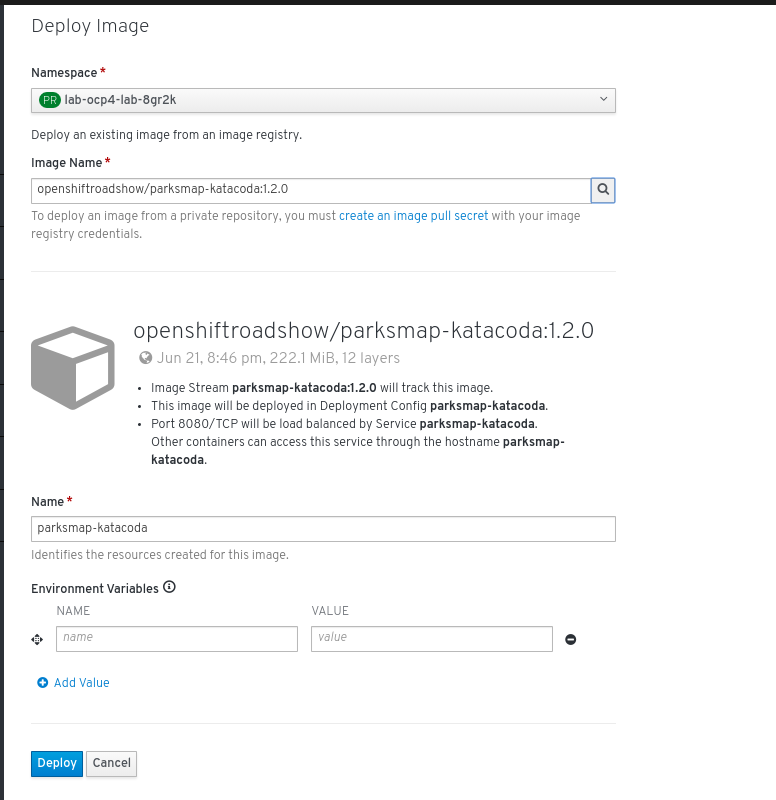
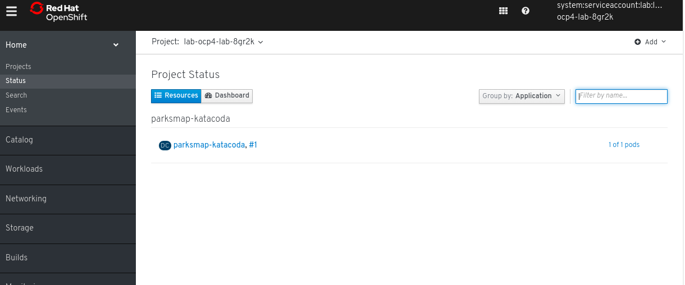
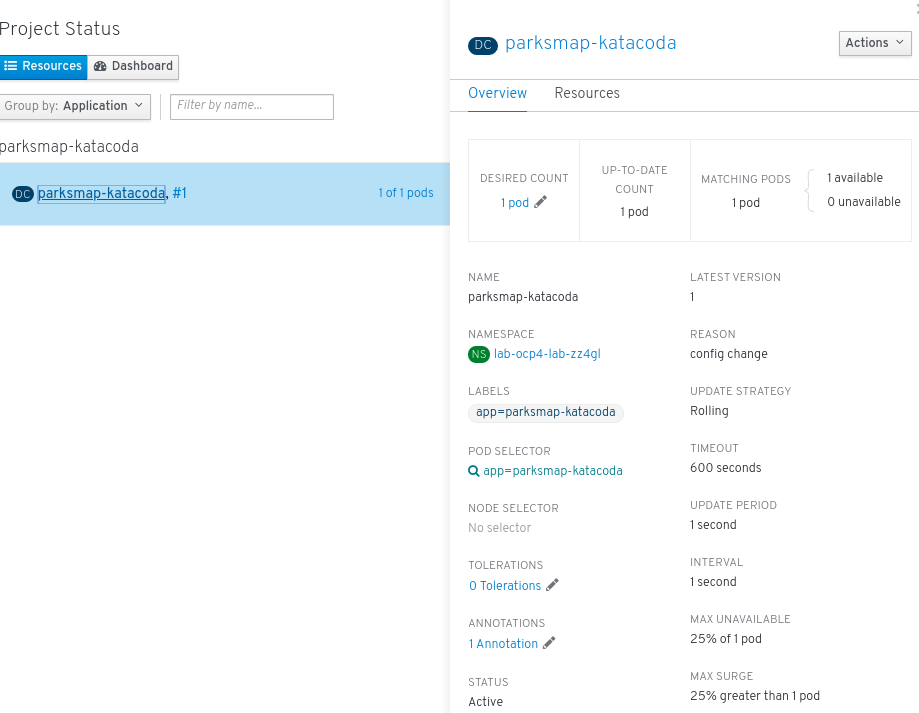
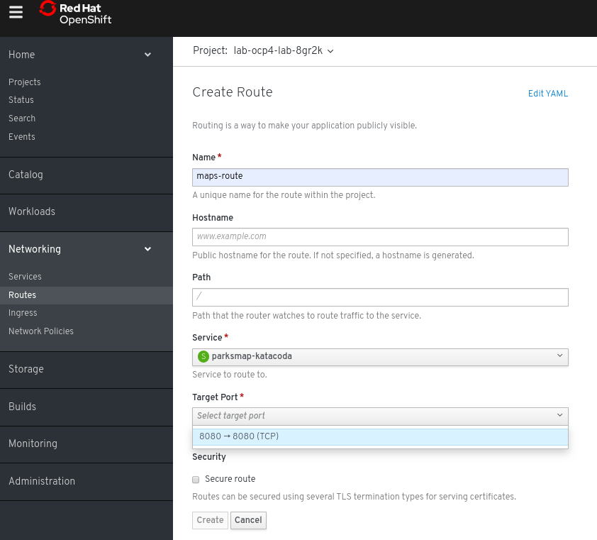
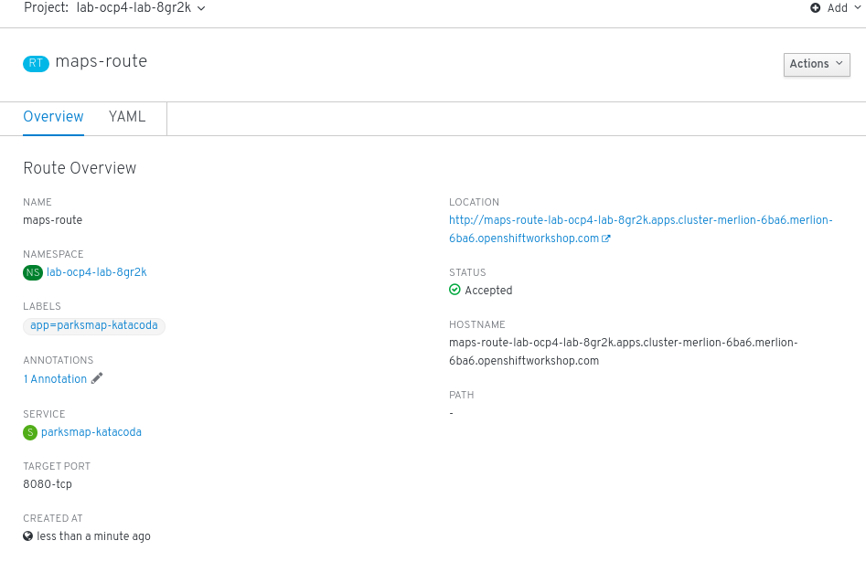

In this lab you will try out how to deploy a cotainerized application via the web console. OpenShift Container Platform offers different ways to deploy your applications. You can deploy a container image; or point Openshift Container Platform to a source code repository, to build and deploy the application. It also allows you to deploy an entire workload via Templates. In this lab, we will see how easy it is to deploy a simple container image via the web console.

On the 'Console' tab, click on 'Home' -> Projects. You will see the a project that is created for you. You will deploy your applications in this project.



Click on the project, you will be brought to the project console which shows that there is no workload running .

To deploy a container image, click on the 'Deploy Image' button at the button of the page. Or you can use the 'Add' menu at the top right to deploy an image.




On the 'Deploy Image' page, enter ```openshiftroadshow/parksmap-katacoda:1.2.0``` into the 'Image Name' textbox and click on the manifying class icon at the side. This will trigger a query from Docker hub to pull down the image information.

Click on 'Deploy' button to deploy the container image on OpenShift.
Behind the scene, Openshift will pull down the image, create the necessary Openshift objects (services, deploymentConfig) and deploy the image.



You will be lead a page showing the status of the deployment.



Click on the deploymentConfig Object to open up a side menu for more information




Next, click on ```Networking -> Routes``` on the left hand menu.
You will create a route to allow external access to the containerized application you have deployed.

Fill up the mandatory values on the ```Create Route``` page according to the screenshot and click on create.




You will be lead to the page displaying information on the Route object you have just created. 



You may want to check if the container you just deployed is running. Go to 'Workload -> Pods' at the side menu.

If it shows a Container (Pod) with a Running status, you can proceed to access the application. 


At 'Networking -> Routes'
Under the ```Location``` section on the right of the page, is the URL to access the application. 
Click on the URL to access the application.


Clean up the resources for this lab, you won't be using them anymore.

```execute
oc delete all --all
```

This concludes the section of the Lab.

